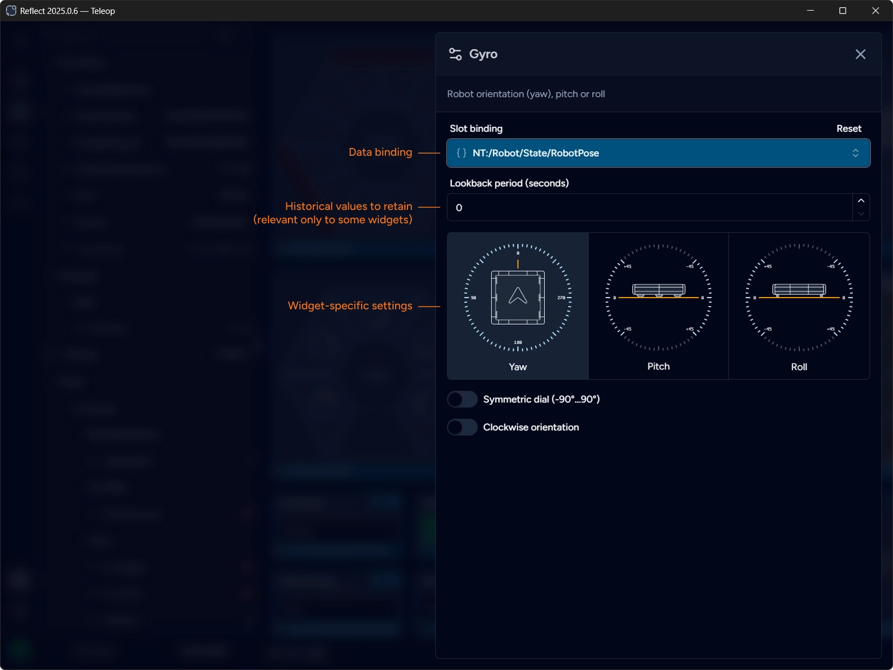

import { EllipsisVertical, Pencil } from "@lucide/astro";

Widgets can be configured by clicking the <Pencil class="inline-block align-middle mt-0 mb-1" size={16} /> button.
The configuration panel opens containing both common and widget-specific settings.

## Common Widget Settings

Every widget has a slot binding and a lookback period configuration options.

Slot binding represents the data channel bound to the widget and allows changing the binding via a drop-down instead of dragging the channel from the gallery.

:::note
Only compatible channels are present in the drop-down.
:::

Lookback period is a value in seconds that represents the amount of historical data points (lookback window) to be retained in memory for the widget.
Most widgets present only the current (most recent) value and do not require access to historical points. Zero (0) disables historical data retention.

Some widgets, such as [charts](/reference/widgets/#line-chart) and [2D field](/reference/widgets/#2d-field), use historical data points to render data over time.

## Custom Widget Settings

Widgets may present a custom settings block that contains configuration options specific to the widget.

For example, [Gyro](/reference/widgets/#gyro) widget have different visual representations for Yaw, Pitch and Roll, and allows configuring the orientation of the dial.
