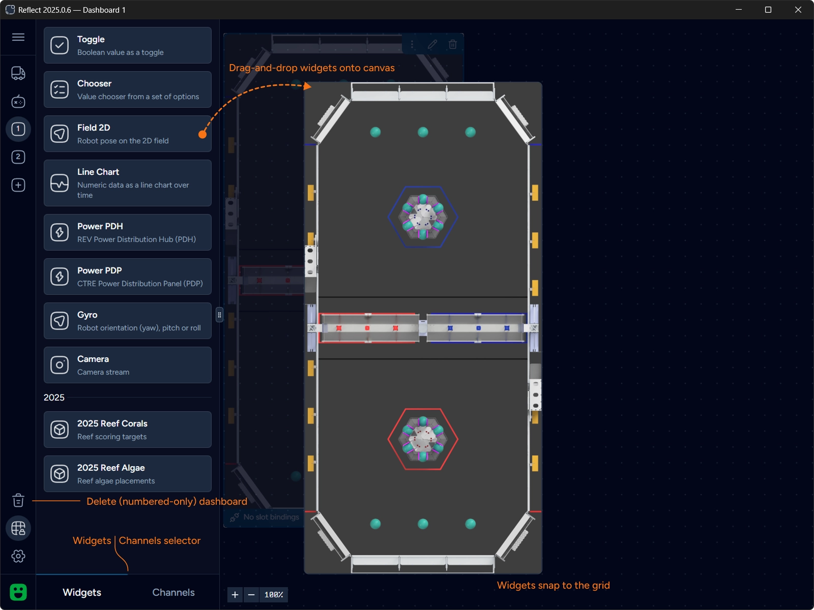
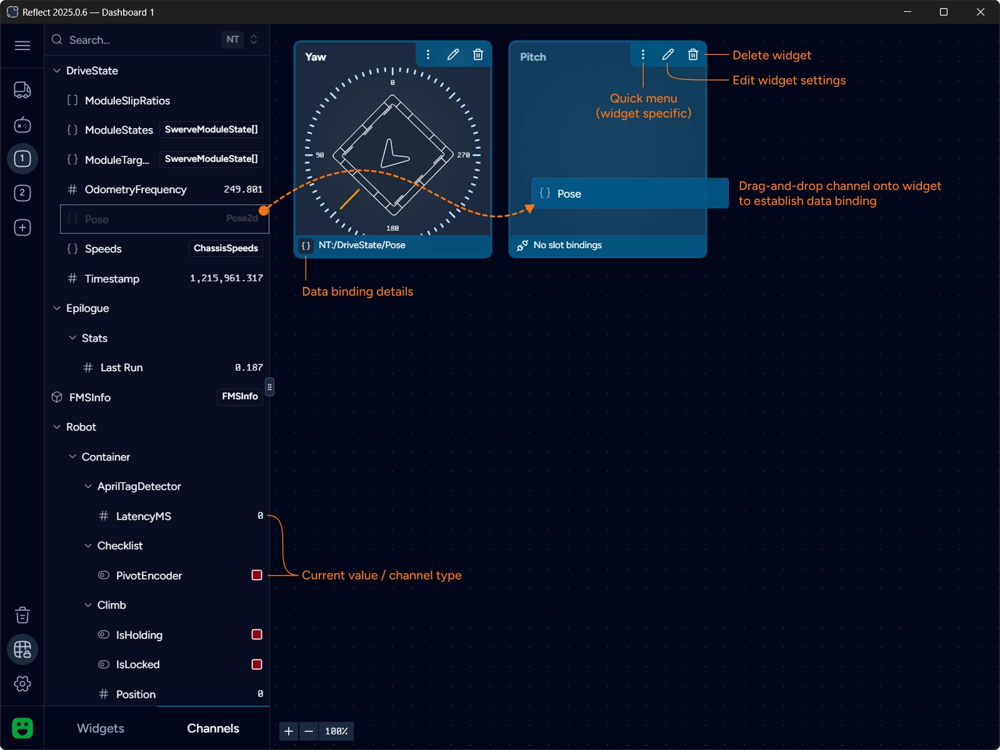

import { EllipsisVertical, Pencil, Trash2 } from "@lucide/astro";

Dashboards can be configured by dragging and dropping widgets onto canvas.
Click `Edit dashboard` button or press `⌘+D` to switch into editing mode.

A panel containing widgets and data channels is displayed in the editing mode.
This panel can be resized by dragging the resize handle.

Click on the widget card in the Widgets gallery and start dragging it onto canvas.
Drop at a location where sufficient space is available.
To relocate an existing widget click on the widget and drag it around the canvas.

:::note
You will not be able to drop or move a widget if the operation results in overlapping widgets.
The border of the active widget will turn red to indicate this.
:::

Most widgets can be resized — hover over one of the widget borders and
the cursor will change to a resize one if resizing in this direction is supported.
Similarly to dragging, you can only resize the widget if there is sufficient space in the given direction.

Widgets automatically snap to the grid when moving or resizing.

To delete a widget click on the <Trash2 class="inline-block align-middle mt-0 mb-1" size={16} /> button in the widget's top-right corner.
You will be prompted for confirmation.

## Data Binding

Widget must be bound to a data channel to display data. Switch to Channels tab to browse discovered channels.
You can use Search area to quickly filter the list of visible channels.

Click on the channel and drag-and-drop it onto a widget.
If the widget accepts the channel it will become bound to this data channel and the binding slot will show the channel name.

:::note
Widgets define compatibility rules for types of channels they accept.
If the widget does not support a channel it will highlight red and would not accept the drop.
:::

The same channel can be used with multiple widgets.
Reflect keeps real-time subscriptions only for bound channels and each channel is subscribed exactly once.

Channels represent topics in the Network Tables. Reflect automatically combines
[Sendable](https://frcdocs.wpi.edu/en/latest/docs/software/telemetry/robot-telemetry-with-sendable.html#what-is-sendable)
data structures that are represented by multiple topics into a single composite channel.
Widgets are designed to consume such composite channels.

Learn more about channels and data transformations in the [Architecture Overview](../reference/architecture#data-transformations) section.

## Configuring Widgets

Widgets can be configured by clicking the <Pencil class="inline-block align-middle mt-0 mb-1" size={16} /> button.
Some widgets also support quick actions via the <EllipsisVertical class="inline-block align-middle mt-0 mb-1" size={16} /> quick menu.

Learn how to [configure widgets](./configure-widgets).

## Deleting Dashboard

To delete a dashboard click `Delete dashboard` button in the sidebar. You will be prompted for confirmation.
Only numbered dashboards can be deleted. Auto and Teleop dashboards cannot be deleted.
