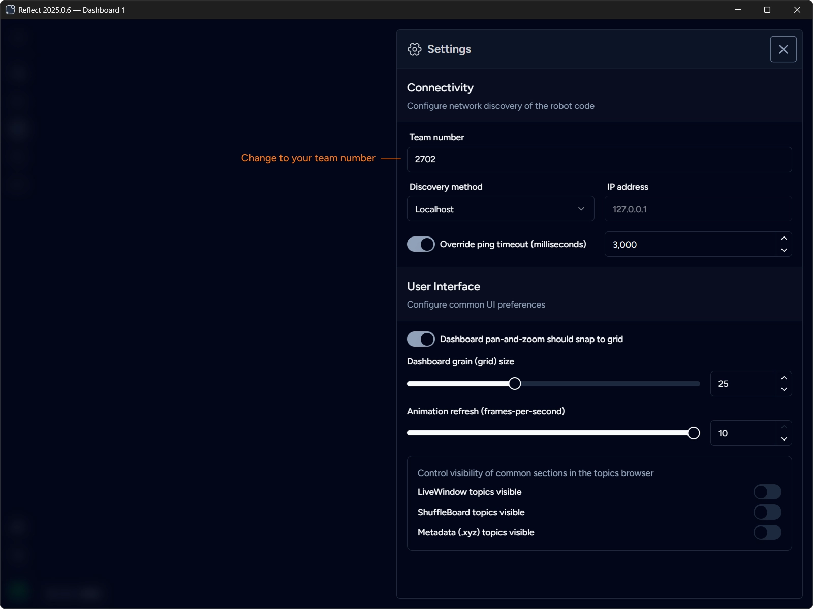

Use settings panel to control global configuration of the application. Click `Settings` button in the sidebar to open the panel.

## Connectivity

This section configures network discovery of the robot code. The following methods are supported:

- **Team IP (10.TE.AM.2)** 
  Derives IP address from the team number. Team number must be specified.
- **RoboRIO mDNS** 
  Uses RoboRIO mDNS name based on the team number, e.g. `roboRIO-2702-FRC.local` for team 2702. Team number must be specified.
- **Localhost** 
  Connects to the localhost (127.0.0.1). Use this method when connecting to a simulator running on the same machine.
- **Custom IP** 
  Uses address specified manually in the IP address field.

:::caution[Important]
Default network discovery mode is `Localhost`. You must change it to the appropriate method before you can connect to the robot.
:::

#### Ping Timeout

Reflect uses Network Tables to connect to the robot.
Network Tables protocol uses keepalive ping-pong packets to track the health of the network connection.
Current version of Network Tables (4.1) sets the default timeout to 1 second.

It is unlikely that you would ever need to change this timeout. However, should the need arise, you can enable the override and specify the custom timeout between 1 and 10 seconds.
Actual value is specified in milliseconds.

## User Interface

This section configures common UI preferences.

#### Season

Allows selection of the game season. This setting impacts availability of season-specific widgets in the gallery. Typically you should keep the current season selected.

#### Dashboard pan-and-zoom should snap to grid

Forces the dashboard canvas to always snap to the grid when panning and zooming. This is the default.
You can disable this setting to shift the layout by an arbitrary amount.

#### Dashboard grain (grid) size

Defines the size of the grid grain. All widgets are measured in the units based on the grain, changing this value effectively scales each widget.
Keep in mind that some widgets may not look ideal if the grain size is too big or too small.

#### Animation refresh (frames-per-second)

Defines the FPS for widgets real-time data updates. Decreasing this value reduces CPU usage at the expense of less frequent updates.
