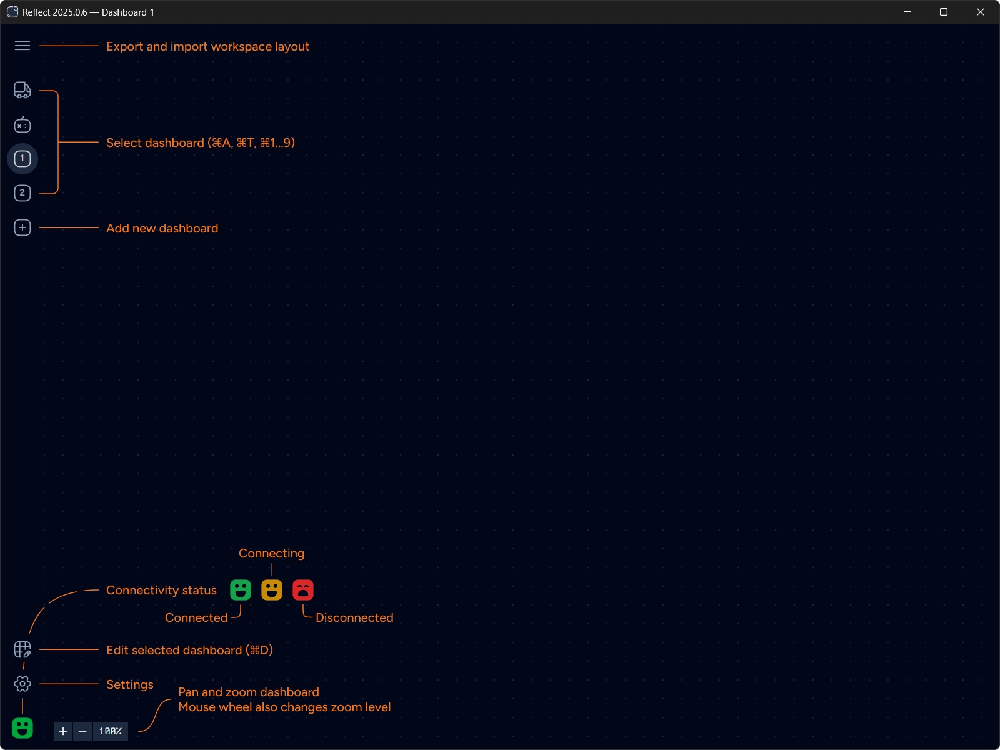

You start with two pre-defined empty dashboards — Auto and Teleop. These dashboards can not be deleted.

Create additional dashboards by clicking `Add dashboard` button. Up to 9 custom dashboards can be created.

:::tip
You can quickly switch between dashboards by using `⌘` or `Ctrl` key + the dashboard number `1...9`, `A` (for Auto) or
`T` (for Teleop).
:::

Changes are saved automatically and are kept in a file stored locally in the user's application settings folder (platform specific).

You can export dashboards configuration into a workspace file to transfer between computers or to maintain different layouts.
Importing a workspace file overrides the current dashboards configuration.

## Connecting to Robot

Reflect uses Network Tables to connect to the robot code. Use [Settings](/getting-started/settings) to select how Reflect discovers the IP address of the robot.

:::caution[Important]
Default network discovery mode is `Localhost`. You must change it to the appropriate method before you can connect to the robot.
:::

Reflect connects automatically and keeps trying until the connection is successful.
If you ever find it stuck press `⌘+R` to reload the application.

The robot face glyph in the bottom-left corner depicts the current status of the connection.

| Icon state                                        | Description        |
| ------------------------------------------------- | ------------------ |
| Green happy   | Connected          |
| Yellow happy | Trying to connect  |
| Red sad         | Disconnected       |

## Editing Dashboards

Click `Edit dashboard` button or press `⌘+D` to switch into [Editing mode](/getting-started/edit-dashboards).
You can then drag-and-drop and configure widgets in the currently selected dashboard.

## Canvas Controls

Dashboard canvas supports panning and zooming. Zoom level can be adjusted via mouse wheel or zoom buttons in the bottom-left corner.
