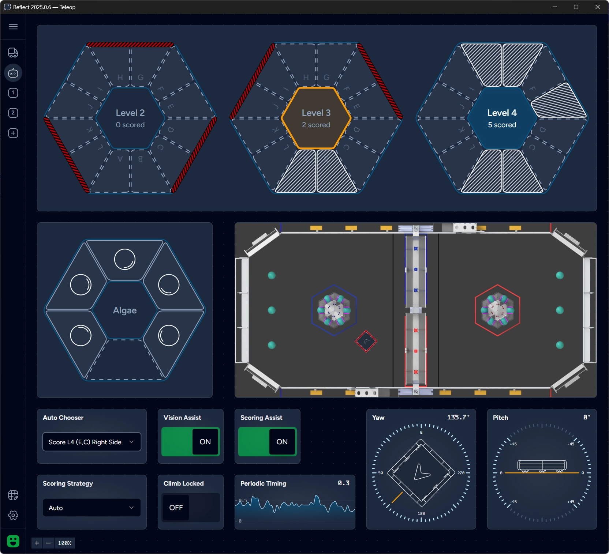

Reflect is a dashboard for FRC that features modern UI, configurable widgets, drag-and-drop, pan-and-zoom capabilities
and multiple dashboard views.

Reflect is built with modern web technologies on [React](https://react.dev/)/[Vite](https://vite.dev/) stack and is written in Typescript.

It is available online at [reflect.2702rebels.com](https://reflect.2702rebels.com/) and as a lightweight
[downloadable cross-platform desktop application](https://github.com/2702rebels/reflect/releases/latest).

To facilitate distribution as a desktop application it uses [Tauri](https://tauri.app/) for packaging. Learn more about [Reflect architecture](./reference/architecture).

## Origin

Reflect has been developed by [Rebels (FRC 2702)](https://2702rebels.com/) and field tested throughout 2025 season.
It is now open-sourced and we continue to support and develop it further.
We also welcome suggestions, bug reports and [community contributions](./contribute).
