## Text or Numeric Value

A value widget displays a text or numeric value.

Accepted channel types:
- primitive `string`, `number`

Configuration options:
- _Title_
- _Content alignment_
- _Content (font) size_
- _Monospace font_
- _Numeric value maximum fraction digits_

## Color Value

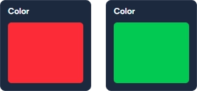

A color widget displays a color based on a string, number or boolean value.

If the bound value is a string then it must contain a [valid CSS color](https://developer.mozilla.org/en-US/docs/Web/CSS/Reference/Properties/color).

If the bound value is a number, it is converted to an RGB color, assuming the lowest 8 bits representing Blue, the next 8 bits representing Green, and the next 8 bits representing Red.

If the bound value is a boolean, then the corresponding color configured in the options is used.

Accepted channel types:
- primitive `string`, `number`, `boolean`

Configuration options:
- _Title_
- _True-value color_
- _False-value color_

## Toggle

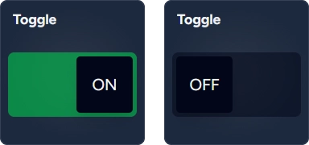

A toggle widget displays a boolean (true/false) primitive.

:::note[Interactive]{icon="forward-slash"}
Allows user changing the value and propagating change back to the channel, when _Interactive_ option is enabled.
:::

Accepted channel types:
- primitive `boolean`

Configuration options:
- _Title_
- _Interactive_

## Chooser

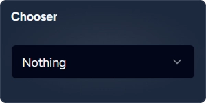

A chooser widget provides a drop-down selector from a list of options.

:::note[Interactive]{icon="forward-slash"}
Allows user changing the value and propagating change back to the channel, when _Interactive_ option is enabled.
:::

Accepted channel types:
- composite [`SendableChooser`](https://frcdocs.wpi.edu/en/latest/docs/software/dashboards/smartdashboard/choosing-an-autonomous-program-from-smartdashboard.html)

Configuration options:
- _Title_
- _Interactive_

## Slider

A numeric slider widget with a configurable range and step.

:::note[Interactive]{icon="forward-slash"}
Allows user changing the value and propagating change back to the channel, when _Interactive_ option is enabled.
:::

:::danger
NetworkTables differentiates between double and integer topics. Attempt to publish a non-integer value to an integer-based topic will fail.
:::

Accepted channel types:
- primitive `number`

Configuration options:
- _Title_
- _Minimum value_
- _Maximum value_
- _Step_
- _Numeric value maximum fraction digits_

## Gyro

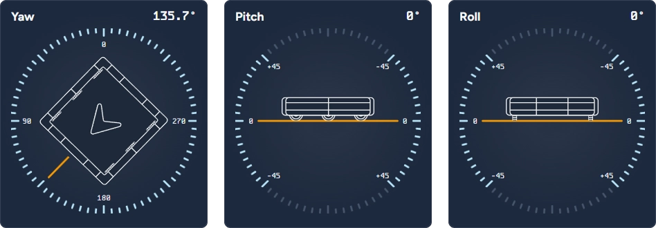

A gyro widget displays a yaw, pitch or roll of the robot.

Accepted channel types:
- primitive `number`, `number[]` (interpreted in radians)
- structured `Pose2d`, `Pose3d`, `Rotation2d`, `Rotation3d`, `Quaternion`
- composite
  [`Field2d`](https://github.wpilib.org/allwpilib/docs/beta/java/edu/wpi/first/wpilibj/smartdashboard/Field2d.html),
  [`Gyro`](https://github.wpilib.org/allwpilib/docs/beta/java/edu/wpi/first/wpilibj/AnalogGyro.html),
  [`ADIS16448 IMU`](https://github.wpilib.org/allwpilib/docs/beta/java/edu/wpi/first/wpilibj/ADIS16448_IMU.html),
  [`ADIS16470 IMU`](https://github.wpilib.org/allwpilib/docs/beta/java/edu/wpi/first/wpilibj/ADIS16470_IMU.html)

Configuration options (Yaw mode):
- _Symmetric dial (-90°…90°)_ — when enabled shows dial with both positive and negative values
- _Clockwise orientation_ — when enabled shows dial in CW orientation, default is CCW

## Line Chart

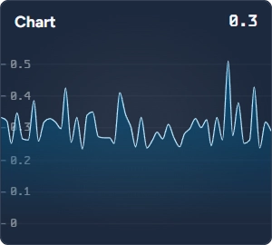

A line chart widget displays a numeric value as a real-time line chart.

:::note[Historical]{icon="seti:clock"}
Requires non-zero _Lookback period_ to show chart over a time window.
:::

Accepted channel types:
- primitive `number`

Configuration options:
- _Title_
- _Current value maximum fraction digits_
- _Axis label maximum fraction digits_

## 2D Field

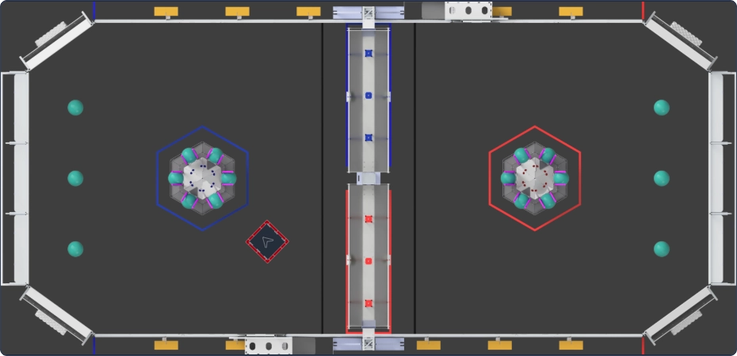

A 2D field widgets displays the pose of the robot on the field. Supports landscape and portrait orientations.

Accepted channel types:
- primitive `number[]` (interpreted as `[x (m), y (m), theta (°)]`)
- structured `Pose2d`, `Pose3d`
- composite
  [`Field2d`](https://github.wpilib.org/allwpilib/docs/beta/java/edu/wpi/first/wpilibj/smartdashboard/Field2d.html)

Configuration options:
- _Style_ — field variant
- _Orientation_ — landscape 0&deg; or 180&deg;, portrait 90&deg; or 270&deg;
- _Bumper size (inches)_ — robot dimensions

## FMS

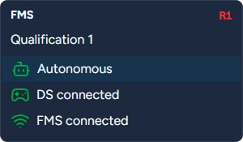

A widget that displays FMS information, including robot state and match information.

This widget comes preconfigured bound to `/FMSInfo`. You should not typically change the default slot binding.

## Power — CTRE PDP

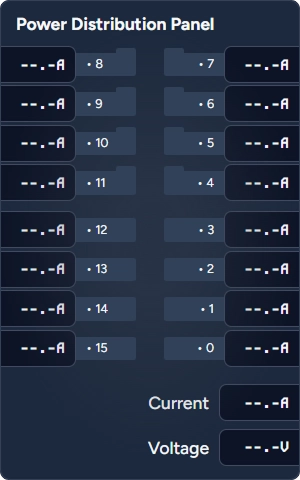

A Power PDP widget displays current and voltage reported by [CTRE Power Distribution Panel (PDP)](https://frcdocs.wpi.edu/en/latest/docs/software/can-devices/power-distribution-module.html).

Accepted cannel types:
- composite
  [`PowerDistribution`](https://github.wpilib.org/allwpilib/docs/beta/java/edu/wpi/first/wpilibj/PowerDistribution.html)

Configuration options:
- _High-current channel alert threshold (A)_
- _Low-current channel alert threshold (A)_

## Power — REV PDH

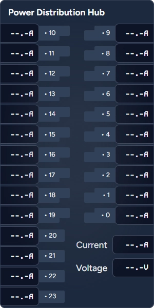

A Power PDH widget displays current and voltage reported by [REV Power Distribution Hub (PDH)](https://frcdocs.wpi.edu/en/latest/docs/software/can-devices/power-distribution-module.html).

Accepted cannel types:
- composite
  [`PowerDistribution`](https://github.wpilib.org/allwpilib/docs/beta/java/edu/wpi/first/wpilibj/PowerDistribution.html)

Configuration options:
- _High-current channel alert threshold (A)_
- _Low-current channel alert threshold (A)_

## Camera

A camera widget displays a video stream. This widget does not require data binding.

Configuration options:
- _Network address (IP or hostname)_
- _Port number_ (defaults to 1181)

# 2025 Season Custom Widgets

These widgets have been developed specifically for 2025 FRC season game objectives.

## 2025 Corals Reef

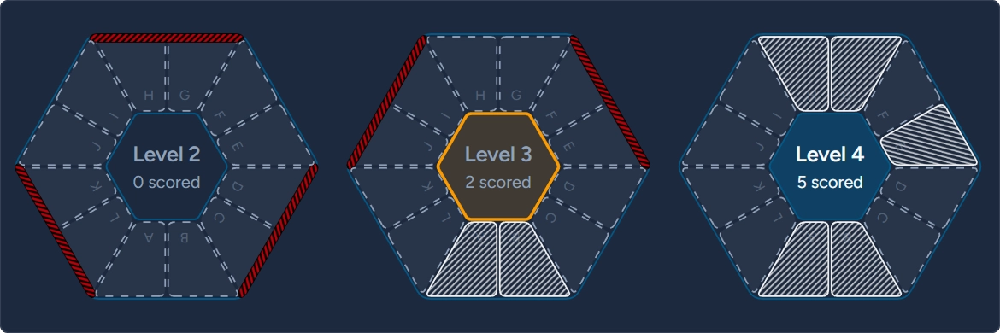

A 2025 Corals Reef widget provides an interactive mechanism to indicate scoring positions on the reef levels (2-4).
It leverages custom data type that captures positions scored, algae presence, and target scoring level.

This widget has been developed to allow operators to assist in scoring and track scoring objectives.

:::note[Interactive]{icon="forward-slash"}
Allows user changing the value and propagating change back to the channel.
:::

Accepted cannel types:
- composite `ReefState` (custom type)

Configuration options:
- _Letters visible_
- _Portrait orientation_
- _Ignore target selection_

## 2025 Algae

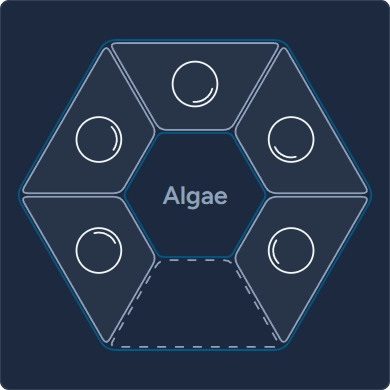

A 2025 Algae Widget accompanies [2025 Corals Reef](#2025-corals-reef) widget and allows operator to control algae presence on the reef.

:::note[Interactive]{icon="forward-slash"}
Allows user changing the value and propagating change back to the channel.
:::

Accepted cannel types:
- composite `ReefState` (custom type)
