## Text or Numeric Value

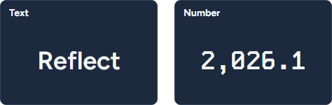

A value widget displays a text or numeric value.

Accepted channel types:
- primitive `string`, `number`

Configuration options:
- _Title_
- _Content alignment_
- _Content (font) size_
- _Monospace font_
- _Numeric value maximum fraction digits_
- _Numeric value transform_

## Color Value

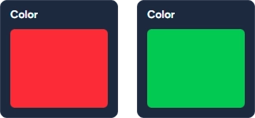

A color widget displays a color based on a string, number or boolean value.

If the bound value is a string then it must contain a [valid CSS color](https://developer.mozilla.org/en-US/docs/Web/CSS/Reference/Properties/color).

If the bound value is a number, it is converted to an RGB color, assuming the lowest 8 bits representing Blue, the next 8 bits representing Green, and the next 8 bits representing Red.

If the bound value is a boolean, then the corresponding color configured in the options is used.

Accepted channel types:
- primitive `string`, `number`, `boolean`

Configuration options:
- _Title_
- _True-value color_
- _False-value color_

## Toggle

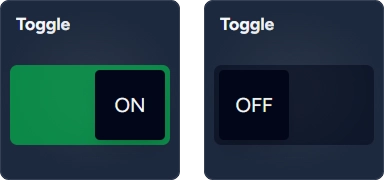

A toggle widget displays a boolean (true/false) primitive.

:::note[Interactive]{icon="forward-slash"}
Allows user changing the value and propagating change back to the channel, when _Interactive_ option is enabled.
:::

Accepted channel types:
- primitive `boolean`

Configuration options:
- _Title_
- _Interactive_

## Chooser

A chooser widget provides a drop-down selector from a list of options.

:::note[Interactive]{icon="forward-slash"}
Allows user changing the value and propagating change back to the channel, when _Interactive_ option is enabled.
:::

Accepted channel types:
- composite [`SendableChooser`](https://frcdocs.wpi.edu/en/latest/docs/software/dashboards/smartdashboard/choosing-an-autonomous-program-from-smartdashboard.html)

Configuration options:
- _Title_
- _Interactive_

## Slider

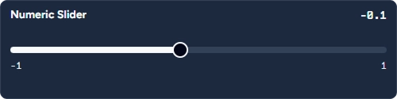

A numeric slider widget with a configurable range and step.

:::note[Interactive]{icon="forward-slash"}
Allows user changing the value and propagating change back to the channel, when _Interactive_ option is enabled.
:::

:::danger
NetworkTables differentiates between double and integer topics. Attempt to publish a non-integer value to an integer-based topic will fail.
:::

Accepted channel types:
- primitive `number`

Configuration options:
- _Title_
- _Minimum value_
- _Maximum value_
- _Step_
- _Numeric value maximum fraction digits_

## Gyro

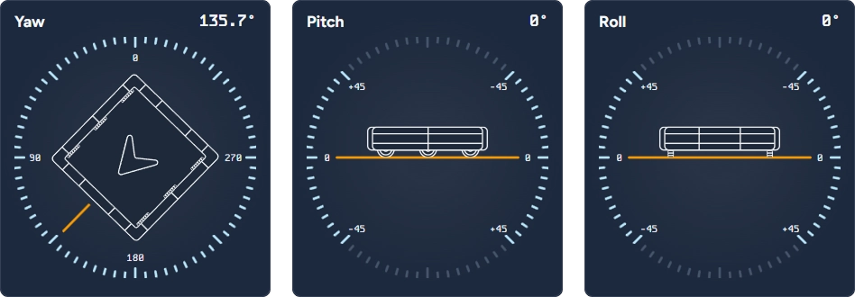

A gyro widget displays a yaw, pitch or roll of the robot.

Accepted channel types:
- primitive `number`, `number[]` (interpreted in radians)
- structured `Pose2d`, `Pose3d`, `Rotation2d`, `Rotation3d`, `Quaternion`
- composite
  [`Field2d`](https://github.wpilib.org/allwpilib/docs/beta/java/edu/wpi/first/wpilibj/smartdashboard/Field2d.html),
  [`Gyro`](https://github.wpilib.org/allwpilib/docs/beta/java/edu/wpi/first/wpilibj/AnalogGyro.html),
  [`ADIS16448 IMU`](https://github.wpilib.org/allwpilib/docs/beta/java/edu/wpi/first/wpilibj/ADIS16448_IMU.html),
  [`ADIS16470 IMU`](https://github.wpilib.org/allwpilib/docs/beta/java/edu/wpi/first/wpilibj/ADIS16470_IMU.html)

Configuration options (Yaw mode):
- _Symmetric dial (-90°…90°)_ — when enabled shows dial with both positive and negative values
- _Clockwise orientation_ — when enabled shows dial in CW orientation, default is CCW

## Radial Gauge

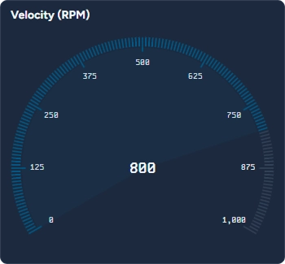

A radial gauge with configurable range and presentation options.

Accepted channel types:
- primitive `number`

Configuration options:
- _Title_
- _Min_ and _Max_ numeric range
- _Start_ and _Stop_ radial angle
- _Minor_ and _Major_ tick step
- _High-_ and _Low-threshold_ for alerting
- _Value (font) size_
- _Numeric value maximum fraction digits_
- _Numeric value transform_

## Linear Gauge

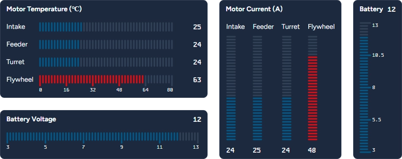

A linear gauge in both horizontal and vertical orientation with support for multiple channels.

By default this widget displays the default slot binding as a single gauge. In multiple channels mode the default slot binding is ignored, instead an explicitly defined set of slot bindings is presented as individual gauges.

Accepted channel types:
- primitive `number`

Configuration options:
- _Title_
- _Vertical_ orientation
- _Multiple-channels_ mode
- _Numeric axis_ visibility
- _Channel label_ visibility (multiple-channels mode only)
- _Channel value_ visibility (multiple-channels mode only)
- _Min_ and _Max_ numeric range
- _High-_ and _Low-threshold_ for alerting
- _Numeric value maximum fraction digits_
- _Numeric value transform_

## Checklist

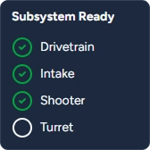

A checklist based on a set of individual boolean channels.

:::caution
Default slot binding is not used for this widget. You must specify channels manually via configuration.
:::

Accepted channel types:
- primitive `boolean`

Configuration options:
- _Title_
- _Channels_

## Swerve

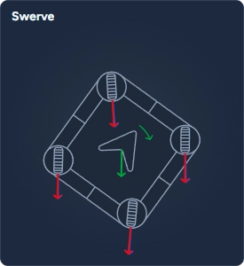

A swerve widget displays rotation, module and chassis speeds.

This widget is designed to work with a custom [SwerveTelemetry structure](https://github.com/2702rebels/reflect/blob/main/reflectlib/SwerveTelemetry.java) that encapsulates information about the swerve subsystem.
See [ReflectLib](/getting-started/reflectlib/#swerve-telemetry) for setup instructions.

Alternatively you can bound this widget to a channel representing an array of `SwerveModuleState` values, but only these module directions and speeds will be shown.

:::tip
Depending on your robot configuration you may need to adjust maximum linear and angular speeds to improve visual representation of the corresponding velocity vectors.
:::

Accepted channel types:
- structured `SwerveTelemetry`, `SwerveModuleState`

Configuration options:
- _Title_
- _Rotate chassis per robot's pose_
- _Show chassis speeds_
- _Maximum linear speed (m/s). Default is 5 m/s_
- _Maximum angular speed (deg/s). Default is 360 deg/s_

## Line Chart

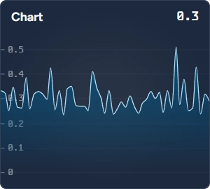

A line chart widget displays a numeric value as a real-time line chart.

:::note[Historical]{icon="seti:clock"}
Requires non-zero _Lookback period_ to show chart over a time window.
:::

Accepted channel types:
- primitive `number`

Configuration options:
- _Title_
- _Current value maximum fraction digits_
- _Axis label maximum fraction digits_
- _Numeric value transform_

## 2D Field

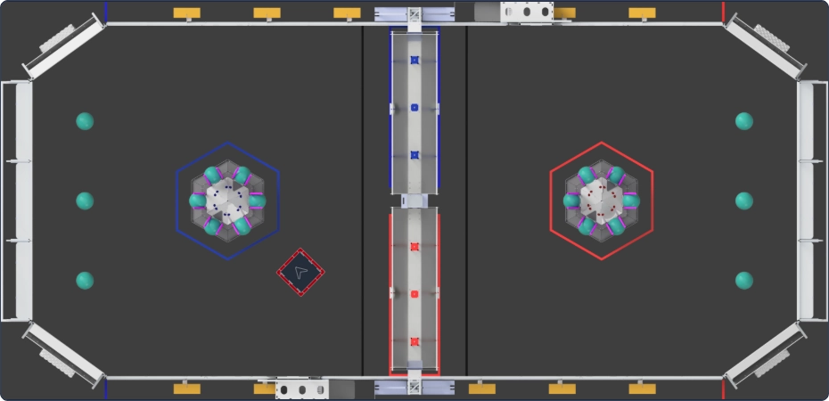

A 2D field widgets displays the pose of the robot on the field. Supports landscape and portrait orientations.

Accepted channel types:
- primitive `number[]` (interpreted as `[x (m), y (m), theta (°)]`)
- structured `Pose2d`, `Pose3d`
- composite
  [`Field2d`](https://github.wpilib.org/allwpilib/docs/beta/java/edu/wpi/first/wpilibj/smartdashboard/Field2d.html)

Configuration options:
- _Style_ — field variant
- _Orientation_ — landscape 0&deg; or 180&deg;, portrait 90&deg; or 270&deg;
- _Bumper size (inches)_ — robot dimensions

## FMS

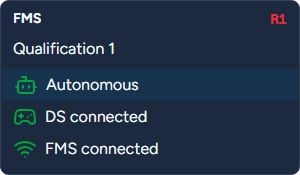

A widget that displays FMS information, including robot state and match information.

This widget comes preconfigured bound to `/FMSInfo`. You should not typically change the default slot binding.

## Match Time

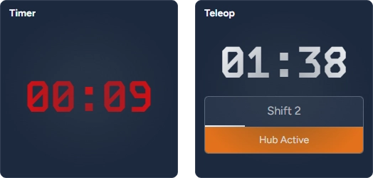

A widget that displays match time, supplemented with the current period and possibly game-specific information.

This widget is designed to work with a custom [MatchTime structure](https://github.com/2702rebels/reflect/blob/main/reflectlib/MatchTime.java) that encapsulates information about the match in progress, including game-specific data.
See [ReflectLib](/getting-started/reflectlib/#match-time) for setup instructions.

Alternatively you can bound this widget to a numeric channel, which is interpreted as the remaining time in seconds.

Accepted cannel types:
- primitive `number`
- structured
  [`MatchTime`](https://github.com/2702rebels/reflect/blob/main/reflectlib/MatchTime.java)

Configuration options:
- _Title_
- _Show game-specific data_
- _Attention time threshold (pulse animation). Default is 5 seconds_
- _Caution time threshold. Default is 30 seconds_
- _Danger time threshold. Default is 10 seconds_

## Alerts

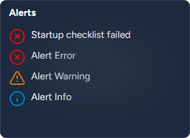

A widget that displays [persistent WPILIB Alerts](https://docs.wpilib.org/en/stable/docs/software/telemetry/persistent-alerts.html).

This widget comes preconfigured bound to `/SmartDashboard/Alerts`. You can change the default slot binding to any other alerts channel. For example, [Choreo publishes its alerts](https://choreo.autos/choreolib/getting-started/#choreo-specific-alerts) under `/SmartDashboard/Choreo Alerts`.

Accepted cannel types:
- composite
  `Alerts`

Configuration options:
- _Title_
- _Show error alerts_
- _Show warning alerts_
- _Show informational alerts_

## Power — CTRE PDP

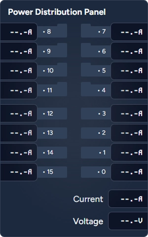

A Power PDP widget displays current and voltage reported by [CTRE Power Distribution Panel (PDP)](https://frcdocs.wpi.edu/en/latest/docs/software/can-devices/power-distribution-module.html).

Accepted cannel types:
- composite
  [`PowerDistribution`](https://github.wpilib.org/allwpilib/docs/beta/java/edu/wpi/first/wpilibj/PowerDistribution.html)

Configuration options:
- _High-current channel alert threshold (A)_
- _Low-current channel alert threshold (A)_

## Power — REV PDH

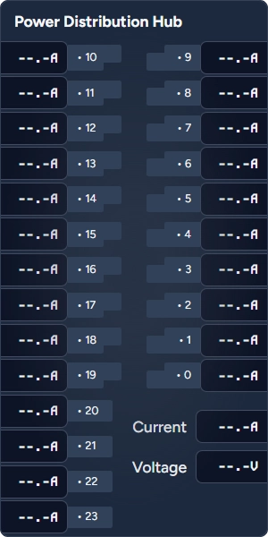

A Power PDH widget displays current and voltage reported by [REV Power Distribution Hub (PDH)](https://frcdocs.wpi.edu/en/latest/docs/software/can-devices/power-distribution-module.html).

Accepted cannel types:
- composite
  [`PowerDistribution`](https://github.wpilib.org/allwpilib/docs/beta/java/edu/wpi/first/wpilibj/PowerDistribution.html)

Configuration options:
- _High-current channel alert threshold (A)_
- _Low-current channel alert threshold (A)_

## Camera

A camera widget displays a video stream. This widget does not require data binding.

Configuration options:
- _Network address (IP or hostname)_
- _Port number_ (defaults to 1181)

# 2025 Season Custom Widgets

These widgets have been developed specifically for 2025 FRC season game objectives.

## 2025 Corals Reef

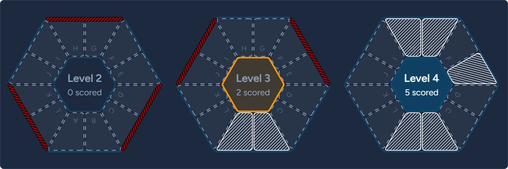

A 2025 Corals Reef widget provides an interactive mechanism to indicate scoring positions on the reef levels (2-4).
It leverages custom data type that captures positions scored, algae presence, and target scoring level.

This widget has been developed to allow operators to assist in scoring and track scoring objectives.

:::note[Interactive]{icon="forward-slash"}
Allows user changing the value and propagating change back to the channel.
:::

Accepted cannel types:
- composite `ReefState` (custom type)

Configuration options:
- _Letters visible_
- _Portrait orientation_
- _Ignore target selection_

## 2025 Algae

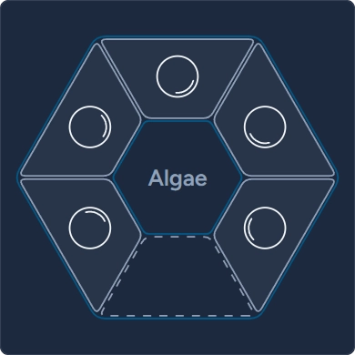

A 2025 Algae Widget accompanies [2025 Corals Reef](#2025-corals-reef) widget and allows operator to control algae presence on the reef.

:::note[Interactive]{icon="forward-slash"}
Allows user changing the value and propagating change back to the channel.
:::

Accepted cannel types:
- composite `ReefState` (custom type)
